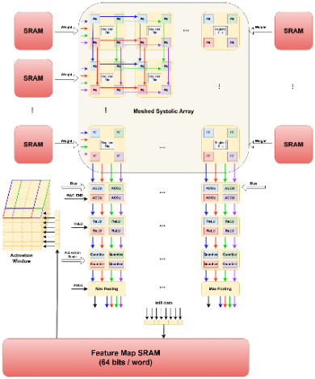

# CNN Accelerator with Shared Weight Storage and Memory Prefetching

A SystemVerilog CNN accelerator with **four 9 × 8 systolic arrays (288 PEs)**,
INT8 weights and activations, and a programmable instruction schedule. The
current RTL combines shared weight storage, streamed activations,
and independent memory/compute instruction fields to overlap useful work
with data loading.

This personal hardware project demonstrates RTL design, systolic dataflow,
memory organization, instruction scheduling, and simulation-based verification.

> **Ownership and academic integrity**
>
> This is **Chia-Heng Liu's independently owned personal project**. Do not
> submit this repository, its RTL, testbenches, diagrams, results, or modified
> copies as your own homework, course project, capstone, or other assessed
> work. Renaming files or making small changes does not make it your work.
> If you discuss or reference this project, clearly credit Chia-Heng Liu and
> link to this repository. Attribution does not make submission as your own
> work acceptable. Preserve existing attribution and third-party notices.

## A concrete prefetch demo

Run `./run.sh prefetch` and inspect `build/prefetch/run.log`. The test runs
two small jobs first with a serial schedule and then with overlapped loads.
Every output is checked against an independent integer model and the serial
result. These are measured RTL simulation counts:

| Two-job workload | Schedule | Active instruction packets | Elapsed clock cycles | Output words |
|:--|:--|--:|--:|--:|
| Convolution | Serial | 11 | 66 | 2 |
| Convolution | Prefetch | 10 | 65 | 2 |
| Fully connected | Serial | 17 | 75 | 8 |
| Fully connected | Prefetch | 13 | 71 | 8 |

“Active packets” count memory and/or compute work; an overlapped packet
counts once. Elapsed cycles are measured inclusively from the first
configuration/load edge to the final output word. They include setup,
pipeline latency, output serialization, and the test's fixed wait between
jobs. Reset and the final post-output wait are excluded. This is a small,
conservative demonstration schedule, not a throughput benchmark.

The FC schedule illustrates where four memory-only cycles disappear:

```text
After the common configuration and initial loads:

SERIAL
compute:  A0 A1 A2 A3 | wait/drain | -- -- -- -- | B0 B1 B2 B3
memory:   -- -- -- -- |    --      | L0 L1 L2 L3 | -- -- -- --

PREFETCH
compute:  A0 A1 A2 A3 | wait/drain | B0 B1 B2 B3
memory:   L0 L1 L2 L3 |    --      | -- -- -- --

A/B = current/next job; 0..3 = its four input-channel issues.
L0..L3 load B's weight pages 1, 9, 17, 25; L0 also loads activation bank 1.
A uses activation bank 0 and weight pages 0, 8, 16, 24.
The wait/drain interval is the same in both schedules.
```

Both convolution runs produce exactly:

```text
word 0: 0909090909090909
word 1: 2424242424242424
```

Both FC runs produce exactly:

```text
job A: 0909090909090909  1212121212121212  1b1b1b1b1b1b1b1b  2424242424242424
job B: 2424242424242424  3636363636363636  4848484848484848  5a5a5a5a5a5a5a5a
```

Each hexadecimal word contains eight INT8 results. The log prints
`DEMO_WORD` records with actual/expected values and completion cycles,
followed by `DEMO_SUMMARY` records for the table above.

## Architecture



The image illustrates the overall compute and memory flow. The shared
regfiles and packed control interface described below reflect the current
RTL; the image is an earlier architectural overview.

| Block | Role in the current RTL |
|:--|:--|
| [Accelerator](rtl/Accelerator.sv) | Connects activation storage, weight storage, four arrays, accumulation, and output processing. |
| [Instruction types](rtl/Instructions.sv) | Defines a 32-bit packet containing a 16-bit memory field and a 16-bit compute field. |
| [Controllers](rtl/Controller.sv) | Separates immediate memory-load control from delayed compute and postprocessing control. |
| [Weight regfiles](rtl/regfiles.sv) | 72 shared 8 × 32-bit files, one for each matching PE position across the four arrays. |
| [Triangle buffers](rtl/Triangle_Buffer.sv) | Skews input rows for systolic alignment and aligns output columns before writing. |
| [Systolic array](rtl/Systolic_Array.sv) | Nine kernel-tap rows and eight output-channel columns per array. |
| [Processing elements](rtl/Processing_Elements.sv) | Signed INT8 multiplication and propagation of 32-bit partial sums. |

The top-level SRAM ports carry already-available data: a 4 × 4 × 8
activation window, a 9 × 8 weight page, 4 × 8 biases, and a scaling factor.
They model the accelerator-side load interface. This checkout does not
include an external memory controller, DMA engine, or technology SRAM macro.

## Dataflow: from a window to an output word

### Convolution

A 4 × 4 activation window contains four overlapping 3 × 3 patches. The four
arrays receive the top-left, top-right, bottom-left, and bottom-right
patches, respectively. For a selected input channel, each array evaluates
nine kernel taps for eight output channels.

1. **Load and retain weights.** A load writes one logical weight page into
   the shared local storage. Subsequent compute instructions select resident
   pages, allowing reuse across spatial windows without reloading them.
2. **Select an activation channel.** A compute field selects one of eight
   channels in one activation bank. The four patches are flattened into
   nine input rows per array.
3. **Align and propagate.** Triangle buffers delay row `r` by the required
   amount. Activations move horizontally through the PE columns; partial
   sums move vertically through the nine rows. The controller delays the
   weight-page selection by `row + column` to follow the same compute wave.
4. **Accumulate across channels.** Each array produces eight partial sums.
   Accumulators combine contributions from successive issued input channels.
   The scheduler marks the final contribution with `store_result`.
5. **Postprocess.** The output path applies optional ReLU, an arithmetic
   right shift, and signed INT8 saturation. Output buffers align the columns.
   Optional 2 × 2 max pooling selects the maximum across the four arrays.
6. **Write results.** A pooled result is one 64-bit word containing eight
   output channels. Without pooling, the four array results are serialized
   into four 64-bit words through `write_valid` and `write_data`.

“Stepwise streaming” refers to advancing the activation channel, spatial
window, and resident weight selection through an explicit instruction
schedule. Weights stay in the local regfiles rather than shifting between
PEs, but their selected addresses may change every cycle. The implementation
therefore supports cyclic weight reuse instead of requiring one fixed
weight for an entire layer.

### Fully connected mode

FC mode presents the same flattened activation patch to all four arrays.
The arrays select different byte lanes from each shared regfile, so they
use different weights for the same input. A compute base page `n` in `0..7`
corresponds to logical pages `n`, `n+8`, `n+16`, and `n+24`, respectively.
This lets the four arrays evaluate separate groups of output neurons.
The supplied FC schedule uses the output path without spatial pooling.

## Shared weight and activation storage

Each group of four PEs at the same row and column across the arrays shares
one **8-entry × 32-bit regfile**. Each entry holds four INT8 weights:

| Storage property | Value |
|:--|:--|
| Number of weight regfiles | 9 × 8 = 72 |
| Capacity per regfile | 8 × 4 bytes = 32 bytes |
| Total weight capacity | 2,304 bytes |
| Logical weight load pages | 32 |
| Activation storage | Two banks, each 4 × 4 × 8 bytes = 128 bytes |

For a five-bit logical weight page, bits `[2:0]` select the entry and bits
`[4:3]` select the byte lane to write. Byte enables preserve the other three
weights. Convolution broadcasts the selected byte to all four arrays; FC
sends one byte lane to each array.

Eight entries preserve the original weight capacity and its 32-page
addressing. Increasing depth also requires extending the instruction and
controller address mapping. Regfile reads are combinational; writes occur
on the rising edge; active-low asynchronous reset clears the entries.
See [weight storage details](docs/weight_regfiles.txt).

## Independent memory and compute control

Each instruction is a packed `Instructions::instruction_t`:

```text
31                         16 15                          0
+----------------------------+----------------------------+
| Memory field (16 bits)     | Compute field (16 bits)    |
| loads, destination pages,  | MAC, source page/channel,  |
| destination bank, mode    | source bank, result flags  |
+----------------------------+----------------------------+
```

`instruction_valid` gates the entire packet. Each field also has its own
`enable`, so a packet can contain memory work, compute work, both, or neither.
`Memory_Controller` handles loads; `Compute_Controller` launches the MAC
wave and delays the weight and output controls. The two fields have separate
weight addresses and activation-bank selections.

For example, compute can read activation bank 0 and weight page 2 while
memory control loads bank 1 and an unused weight page 7. Selecting bank 1
in a later compute instruction consumes the prefetched window. The fields
issue together; they are not separate queues with independent backpressure.
This **32-bit interface replaces the earlier 16-bit opcode interface**.
The datapath remains integer arithmetic; there is no floating-point unit.

### Scheduling rules

- **Present SRAM data before the load edge.** There is no external-memory
  latency handshake; the driver must arrange for the data to be ready.
- **Prefetch into available storage.** Use the other activation bank when
  the current window is still needed. A same-edge read and load of one bank
  consumes its old contents; the new contents become available afterward.
- **Preserve weights for every in-flight PE.** A weight page must remain
  valid until the last PE in its systolic wave has consumed it. A page being
  unused by the current issue alone is not enough to make overwriting safe.
- **Drain before changing shared configuration.** Bias loads initialize
  accumulators; bias, scaling factor, and Conv/FC mode are not double-buffered.
  Change them only after outstanding compute and output writes finish.
- **Respect output and accumulator dependencies.** Bank selection does not
  create separate accumulator contexts. Complete each reduction and respect
  output serialization before scheduling an independent result.

There is no automatic hazard scoreboard or interlock. These dependencies
are part of the kernel schedule. The complete bit layout, helper argument
order, and timing contract are in [instructions.txt](docs/instructions.txt).

## Behavioral SystemVerilog kernel programming

The supplied layer “kernels” are **behavioral testbench tasks** that prepare
SRAM-port data and issue packets on clock boundaries. They are executable
simulation drivers, not CPU software, a compiler, or synthesizable memory
controllers. The synthesizable datapath is under `rtl/`; layer loops, file
I/O, expected-result calculations, and instruction schedules are under `tb/`.

A layer driver typically loads parameters, prepares a window, issues one
MAC per participating input channel, finishes the reduction, and checks
output writes before moving to the next tile. The final input-channel
packet requests result generation and any ReLU/pooling required by that
layer. Separate fields allow the driver to place safe next-tile loads in
otherwise useful compute cycles.

Here is a packet-construction fragment for a driver with an active window
and weights already loaded. It illustrates named fields; the driver must
also supply the SRAM data and assert `instruction_valid` before the edge:

```systemverilog
import Instructions::*;
instruction_t packet;

packet = '0;
packet.mem.enable          = 1;
packet.mem.load_weight     = 1;
packet.mem.weight_addr     = 7; // Must be unused by in-flight work.
packet.mem.load_activation = 1;
packet.mem.activation_bank = 1;

packet.ops.enable             = 1;
packet.ops.mac                = 1;
packet.ops.activation_channel = 3;
packet.ops.weight_addr        = 2;
packet.ops.activation_bank    = 0;
```

For compact schedules, the same packet can be constructed with helpers:

```systemverilog
packet = pack_instruction(
    memory_op(5'd7, 1, 0, 0, 1, 1, 0, 0),
    compute_op(3'd3, 5'd2, 1, 0, 0, 0, 0)
);
```

A simple behavioral issue task follows the convention used by the prefetch
testbench. Signals are driven after a falling edge and sampled by the RTL
at the following rising edge. The driver must replace the packet each cycle
or issue `'0` to prevent repeating a command:

```systemverilog
task automatic issue(input instruction_t packet);
    @(negedge clk);
    instruction_valid = 1'b1;
    instruction = packet;
endtask

// In a driver task/initial block, after loading the window and weights:
for (int ch = 0; ch < 8; ch++) begin
    issue(pack_instruction('0,
        compute_op(3'(ch), 5'(ch), 1, ch == 7, ch == 7, ch == 7, 0)));
end
issue('0); // Stop issuing while the compute/output pipeline drains.
```

This example assumes a convolution reduction over eight input channels
using pages 0–7, with ReLU and pooling enabled on completion. It is a
scheduling fragment, not a complete layer: reset, parameter loading,
SRAM-port data preparation, output collection, and timeout checks are also
required. See [tb_prefetch.sv](tb/integration/tb_prefetch.sv) for complete
serial and overlapped Conv/FC examples, or the [layer tests](tb/layers) for
the supplied image/weight workload.

## Project layout

```text
rtl/                  Synthesizable datapath, controllers, and packet types
tb/
  unit/               Regfile, controller, triangle, and systolic tests
  integration/        Functional and serial/prefetch equivalence tests
  layers/             CONV1, CONV2, CONV3, and FC behavioral drivers
data/                 Input image and quantized weight text files
docs/                 Instruction/storage details and architecture image
run.sh                Simulation entry point
synth.sh              Synthesis, timing, and gate-test entry point
scripts/              Reproducible synthesis runner
build/                Generated binaries, logs, feature maps (ignored)
local/legacy/         Preserved original local tool files (ignored)
```

`local/legacy/` exists only in the original workspace and is not required
by the source checkout. Technology libraries, vendor tool projects,
synthesis reports, generated waveforms, and binaries are not published.

## Run the simulations

Install **Icarus Verilog** (`iverilog`, `vvp`) for the regfile test and
**Verilator**, **Make**, and a **C++20 compiler** for the other tests.
On macOS with Homebrew:

```sh
brew install icarus-verilog verilator
```

From the project root:

```sh
./run.sh                 # Accelerator functional test (default)
./run.sh regfiles        # Shared weight storage test
./run.sh controller      # Independent field decode and control delays
./run.sh prefetch        # Serial versus overlapped Conv/FC schedules
./run.sh triangle        # Triangle buffer test
./run.sh systolic        # Systolic array test
./run.sh functional      # Accelerator functional test
./run.sh network         # CONV1 → CONV2 → CONV3 → FC
./run.sh all             # All ten testbenches
./run.sh help            # Available commands
```

The script resolves paths relative to itself and also works when invoked
by absolute path from another directory. Compilation errors, simulation
failures, and missing pass markers produce a nonzero exit status.

Build and simulation logs are in `build/<target>/build.log` and
`build/<target>/run.log`; the Icarus regfile test has only a run log.
Network logs are in `build/network/<layer>/`. Every network run uses a
fresh `build/network/run.XXXXXX/` directory for copied inputs and generated
feature maps. Layers execute in order so each consumes the previous layer's
new outputs. Files in `data/` are never overwritten. Optional vendor FSDB
and gate-level hooks are not enabled by the runner.

## Layer-by-layer SRAM memory-image demo

The neural-network tests use an **idealized, behavioral SRAM model for
demonstration**: SystemVerilog arrays hold data, testbench tasks drive the
SRAM input ports, and captured output words are saved as text. This makes
intermediate activations easy to inspect without a physical SRAM macro.
The model does not reproduce SRAM access latency, banking conflicts, or a
complete memory bus protocol.

Run `./run.sh network` to execute the layers in sequence. Each convolution
layer prints its simulated SRAM writes in its log and exports a feature-map
**memory image**. Here, “image” means a text dump of memory words, not a PNG.
The next layer reads those files as its input activations:

| Test | Reads activations from | Writes or reports |
|:--|:--|:--|
| CONV1 | `image.txt` | `CONV1_OF_Map.txt` |
| CONV2 | `CONV1_OF_Map.txt` | `CONV2_Tile1_OF_Map.txt`, `CONV2_Tile2_OF_Map.txt` |
| CONV3 | Both CONV2 tile files | `CONV3_Tile1_OF_Map.txt`, `CONV3_Tile2_OF_Map.txt` |
| FC | Both CONV3 tile files | Final output words and feature values in the FC log; no further activation file |

Each generated feature-map word is written as **16 hexadecimal digits**
representing a 64-bit word with eight INT8 output-channel activations.
Within a word, channel 0 occupies bits `[63:56]` and channel 7 occupies
bits `[7:0]`. Words are grouped into spatial rows; separate tile files hold
different output-channel groups. The starting `image.txt` instead contains
decimal input pixel values.

The runner prints the fresh `build/network/run.XXXXXX/` directory containing
these memory images. Per-layer SRAM-write traces and result checks are in
`build/network/CONV1/run.log`, `CONV2/run.log`, `CONV3/run.log`, and
`FC/run.log`. This file-based handoff demonstrates the full activation flow
between separate layer simulations. It is not an on-chip layer sequencer.
Generated memory images remain ignored by Git and are recreated on each run.

## Verification and limits

All **ten testbenches passed** locally using Icarus Verilog and Verilator:

- Register-file tests cover byte masks, retention, reset, and read/write timing.
- The controller test checks 300 deterministic randomized packet cycles,
  independent enables and addresses, reset during traffic, and control delays.
- The prefetch test checks 20 output words against an independent integer
  model and compares serial with overlapped Conv/FC schedules. Its schedules
  eliminate one memory-only issue cycle for Conv and four for FC.
- Block, accelerator-functional, and ordered layer tests check the remaining
  compute flow. Malformed input rows stop the layer simulations.

The measured issue-cycle savings are specific to these schedules. Functional
simulation does not establish silicon timing, area, power, or a general
throughput improvement. The synthesis section below reports the current revision separately;
physical implementation and power remain unmeasured.

## Synthesis results and operation counting

The synthesis results below describe the current RTL and its constraints.
A configured clock target is not a measured operating frequency. Post-synthesis cell area is not placed core
area, and results from different cell libraries are not directly comparable.

### Current revision: Nangate45 synthesis estimate

The current RTL was mapped with sv2v → Yosys/ABC and analyzed with OpenSTA,
using the installed tools and Nangate45 library from the local Mixed
Precision Conference project. The final mapping includes buffering and
cell sizing with explicit drive/load constraints.

| Current-revision result | Value |
|:--|:--|
| Library | Nangate45 typical, 1.1 V / 25 °C |
| Mapped standard-cell area | **566,058 µm²** |
| Mapped cell count | **357,599** |
| Mapping/STA clock target | 2.5 ns / 400 MHz |
| Worst setup slack at that target | **+0.01 ns — target met** |
| Estimated minimum period | **2.49 ns**, approximately **402 MHz** |
| Zero-delay mapped-netlist check | **20/20 output words pass**, with the same cycle counts as RTL |

These are **pre-layout estimates**, with an ideal clock and cell-pin loads.
There is no placement, routed wiring, extracted parasitics, clock-tree
implementation, or power analysis. The minimum-period estimate is not a
silicon frequency claim. Storage is mapped to standard cells, not SRAM
macros.

**Storage implementation affects area.** In this flow, the weight regfiles
are synthesized into flip-flops, read-selection logic, and write-control
logic rather than dedicated register-file or SRAM macros. Integrating a
compatible memory macro could reduce storage area. The amount is not yet
measured, and the total implemented area also depends on interface logic,
buffering, placement, and routing. Macro integration must preserve—or
explicitly adapt—the current combinational reads, byte write enables, and
reset behavior; it is not a drop-in area correction to this estimate.

Reproduce the flow with:

```sh
./synth.sh
```

The default dependency location is `~/Desktop/Mixed Precision Conference`.
For another installation, specify the library and OpenSTA executable:

```sh
LIBERTY_PATH=/path/to/NangateOpenCellLibrary_typical.lib \
STA_BIN=/path/to/sta ./synth.sh
```

`sv2v`, `yosys`, `iverilog`, and `vvp` must also be on `PATH`. The gate
netlist is large; its Icarus compilation can take several minutes. Reports,
netlists, functional cell models, and dependency copies remain under ignored
`build/synthesis/`. See [synthesis constraints and provenance](docs/synthesis.txt).

### Integer-operation counting

This is an INT8 datapath. We use **GOPS/s**, with one multiply plus one
accumulation counted as **two integer operations**. Under that convention,
288 active PE MAC equivalents per cycle would give:

```text
peak GOPS/s = 288 × 2 × clock_frequency_Hz / 1e9
```

At the 400 MHz synthesis target, the theoretical ceiling is 230.4 GOPS/s
(115.2 GMAC/s). This assumes full utilization and excludes load, drain, and
output overhead; it is not a measured application-throughput result.

## References

[1] Y.-H. Chen, T. Krishna, J. S. Emer, and V. Sze,  
“**Eyeriss: An Energy-Efficient Reconfigurable Accelerator for Deep Convolutional Neural Networks**,”  
*IEEE Journal of Solid-State Circuits*, vol. 52, no. 1, pp. 127–138, Jan. 2017.  
DOI: [10.1109/JSSC.2016.2616357](https://doi.org/10.1109/JSSC.2016.2616357)

[2] N. P. Jouppi *et al.*,  
“**In-Datacenter Performance Analysis of a Tensor Processing Unit**,”  
*Proceedings of the 44th Annual International Symposium on Computer Architecture (ISCA)*, pp. 1–12, 2017.  
DOI: [10.1145/3079856.3080246](https://doi.org/10.1145/3079856.3080246)

[3] Xilinx Inc.,  
“**DPUCADX8G IP Core Product Brief: Deep Learning Processor Unit (DPU) for Alveo U200/U250**,”  
2020. [Online]. Available: [https://docs.amd.com/r/1.2-English/ug1414-vitis-ai/Alveo-U200/U250-DPUCADX8G](https://docs.amd.com/r/1.2-English/ug1414-vitis-ai/Alveo-U200/U250-DPUCADX8G)

---

### Author
**Chia-Heng Liu**  
M.Eng. ECE, Cornell University  
Email: [chialiu0618@gmail.com](mailto:chialiu0618@gmail.com)  
GitHub: [ChiaLiu0618](https://github.com/ChiaLiu0618)  
LinkedIn: [linkedin.com/in/chia-heng-liu-chialiu20020618](https://www.linkedin.com/in/chia-heng-liu-chialiu20020618)
